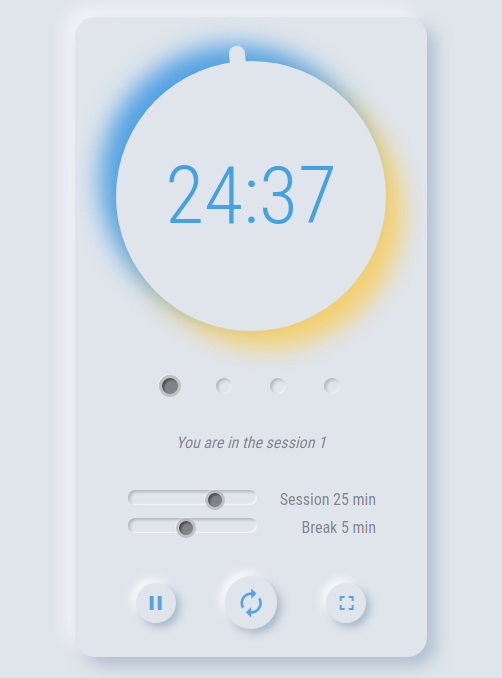

# Vanilla JavaScript Pomodoro-Timer

## Live demo

👉 [Click here](https://olafro.github.io/Pomodoro-Timer/) 👈

## About

Project finishing browser module of DCI web-developer course.

Pomodoro Timer is a tool that helps you focus on work and don't forget about
taking breaks.

After 25 minutes of work <em>(session)</em> you get a short break <em>(5
minutes)</em> after which you start next session. By finishing the session
number four, you can take a longer break <em>(20 minutes)</em>. With new energy
you can than start whole cycle again.

[More information about Pomodoro Technique](https://en.wikipedia.org/wiki/Pomodoro_Technique)

## Technologies used

- Vanilla JS
